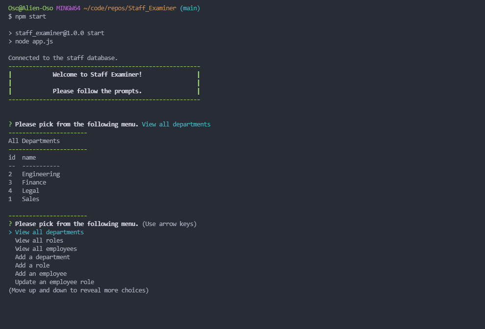

# Staff_Examiner
---

  
  
   
   
   
## Description

This project allows a small company to use a MySQL Database to keep track of their staff.  It uses MySQL2, Inquirer, and Console.table to function.  It demonstrates the management of a Database from setting up of the db, its schema, and its seeding.

---
  ## Table of Contents

  [Features](#features)

  [Screenshot](#screenshot)

  [Installation](#installation)
    
  [Usage](#usage)
    
  [License](#license)
    
  [Contributing](#contributing)

  [Questions](#questions)
  
  

---

## Features

      1. Uses MySQL2. 

      2. Uses Inquirer. 

      3. Uses Console.table. 

      4. Completely built DB, from creation of schema and seeding of data. 
---

## Screenshot 
  

  
  [Here is a link to a video showing me using Staff Examiner to manipulate the Staff Database](https://drive.google.com/file/d/1Ioo038Y2-HMVUMeJm_OD1cpGjHMahOiE/view?usp=sharing)
  
  

  ---

  ## Installation

      1. Clone the repository. 

      2. Type npm install 

      3. Type nmp start at the console and follow the prompts. 
---
  ## Usage

      1. Type npm start at the command prompt. 

  ---
  ## License 

  &emsp; 

      To read about the license of this project click the link below.

  &emsp;[License](https://github.com/tgtiburon/Staff_Examiner/blob/main/LICENSE) 

  ---
  ## Contributing

      1. Email me, or contact me via the Issues Tracker on the github repo. 

---
## Questions

If you have any questions about this project feel free to email me at <tg.tiburon@gmail.com>.  

To see the rest of my portfolio, visit [Github](https://github.com/tgtiburon).

Below is a graphic displaying my most used languages on github.

This Readme file was created with Readme Architect by Tony Gendreau &copy;
